BPlus Tree
====================
Building with Travis: 

This repository has a project with the implementation of a BPlus Tree.

It is written in C++.

The code of the BPlus Tree is independent of platform.

Is has two possible main files:

* [Codes](#markdown-header)
	* [A main that triggers unit test;](#markdown-header-emphasis)

	* [A Qt project to manage the BPlus Tree (With Gui).](#markdown-header-strikethrough)
	
The library used to make the Unit Test is the Catch v2.12.3. The code is already in this repository.

The Qt project generates images of the BPlus Tree, using the lib Graphviz.
Install this lib in your computer for you to be able to create such images.

The code was written containing the Doxygen documentation.

- - -

You have several options to build the project: 
====================

* [Build tools](#markdown-header)
	* [Makefile (using the file named MakefileGeneral);](#markdown-header-emphasis)
	* [CMake.](#markdown-header-emphasis)
	* [Qt Project (With QMake).](#markdown-header-emphasis)

The project has no leaks (Fully tested with Valgrind).

All the unit tests are ok.

- - -

The functionalities available are: 
====================

* [Functionalities](#markdown-header)
	* [Insert;](#markdown-header-emphasis)
	* [Search;](#markdown-header-emphasis)	
	* [Remove.](#markdown-header-emphasis)
	
- - -

Sample images: 
====================

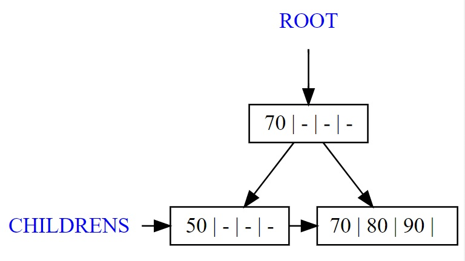

Qt gui project: 
====================
The qt gui application gui is shown below:

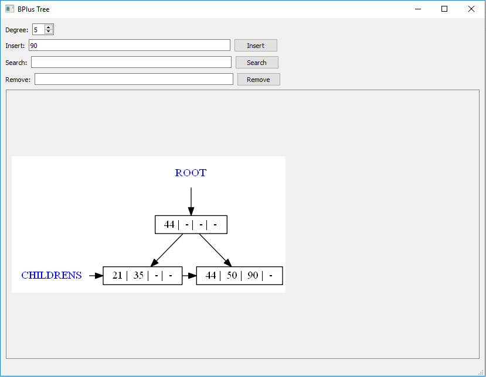

Insertion steps: 
====================

## Initial:

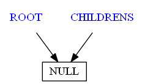

## Inserting 40:

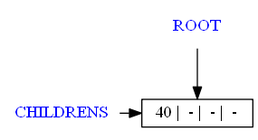

## Inserting 50:

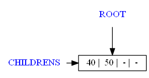

## Inserting 75:

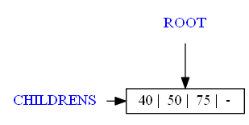

## Inserting 35:

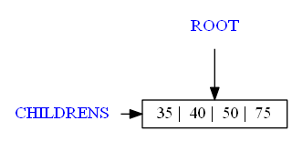

## Inserting 20:

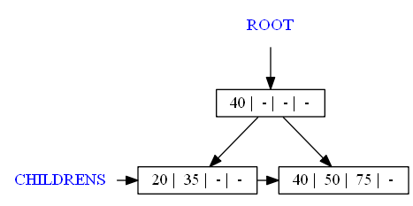

## Inserting 60:

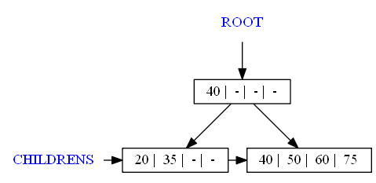

## Inserting 4:

## Inserting 2:

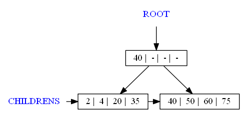

## Inserting 80:

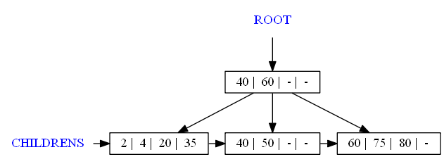

## Inserting 90:

## Inserting 100:

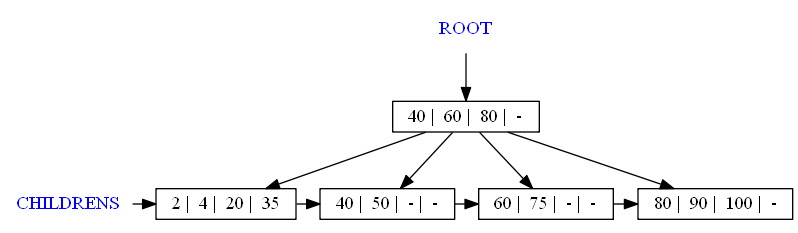

## Inserting 110:

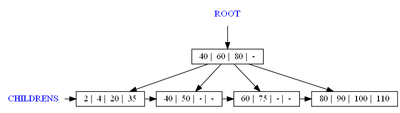

## Inserting 120:

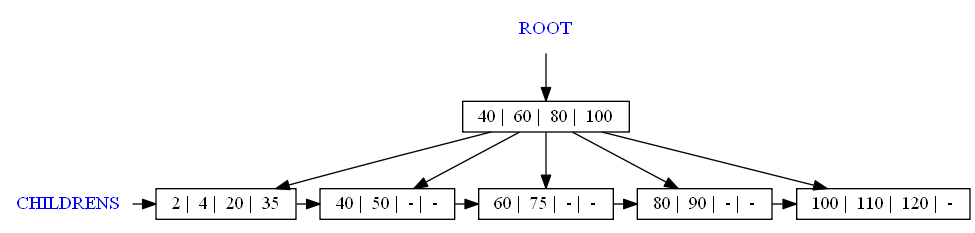

## Inserting 130:

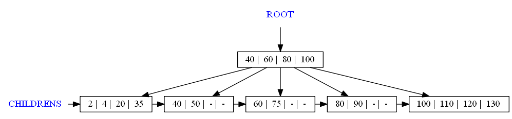

## Inserting 140:

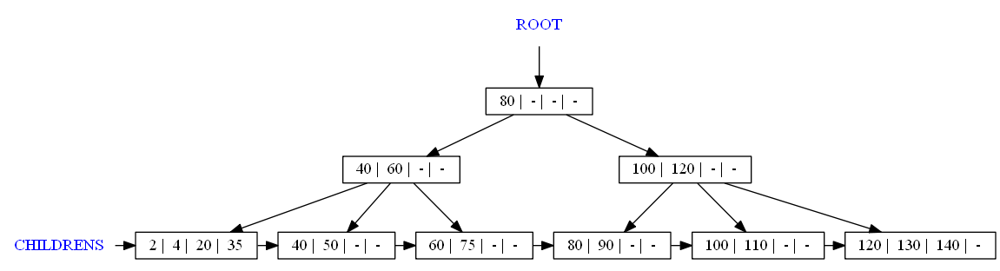

Removing samples: 
====================

## Initial:

## Removing 140:

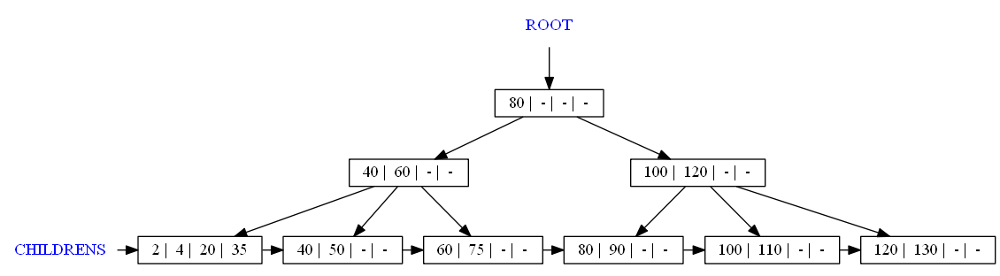

## Removing 130:

## Removing 100:

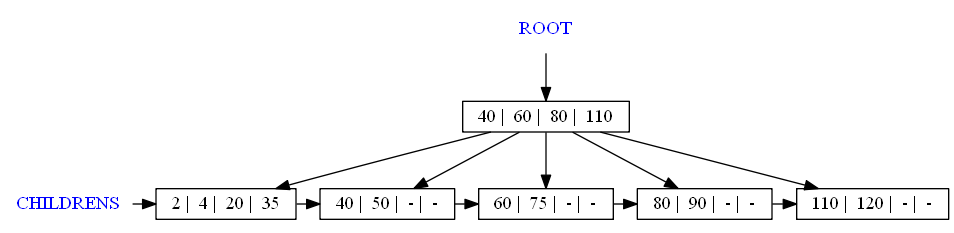

## Removing 40:

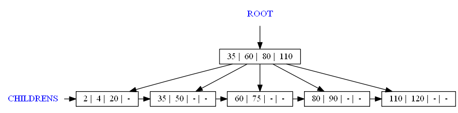

## Removing 4:

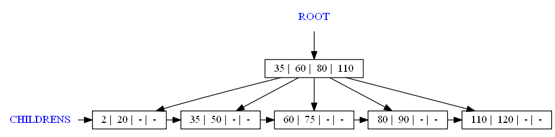

## Removing 110:

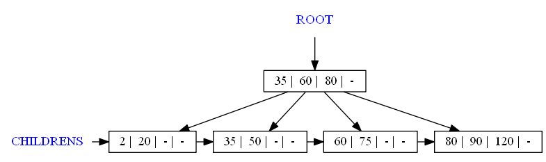
